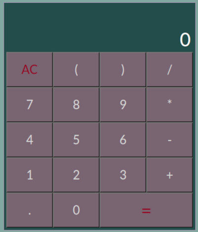
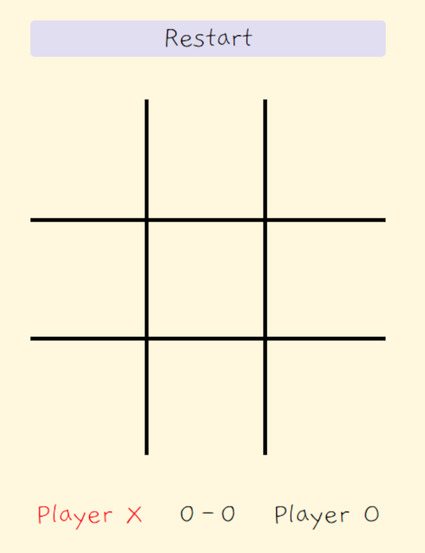
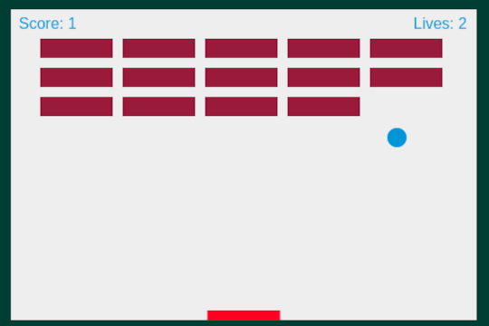

# iSA Project 2

Repo of my second project for the Junior Front End Developer bootcamp at the infoShare Academy.

## Table of contents
* [General info](#general-info)
* [Technologies](#technologies)
* [Apps/Games](#apps/games)
  * [JS Calculator](#js-calculator)
  * [Tic Tac Toe](#tic-tac-toe)
  * [Breakout 2D](#breakout-2d)
* [Status](#status)
* [Contact](#contact)

## General info
Project consists on simple apps and games in Vanilla JavaScript. It was created to utilize the knowledge gained during the first 3-4 weeks of the bootcamp in real-life apps.

[Starting page](https://pachulski.github.io/jfddr1-project-2/) - page with links to the project apps/games

## Technologies
 \
 \

## Apps/Games

### JS Calculator
Fairly simple calculator with a possibility to input longer mathematical expressions. App utilizes the [Math.js](https://mathjs.org/) library to run calculations.

[JS Calculator](https://pachulski.github.io/jfddr1-project-2/src/js-calculator/index.html) - direct link to the calculator website

 

 

### Tic Tac Toe
A basic version of the Tic Tac Toe game. Restart button allows to clean the board and play more than one round. Score board allows to track score during an open session. The score board resets to '0-0' after page refresh.

[Tic Tac Toe](https://pachulski.github.io/jfddr1-project-2/src/tic-tac-toe/index.html) - direct link to the Tic Tac Toe website

 

 

### Breakout 2D
A simple breakout game written entirely in Vanilla JavaScript and rendered on HTML5 canvas element. Player has 3 lives before game over. Number of lives is displayed on the canvas. Game also tracks score and displays it on the canvas. Player gets 1 point per each brick hit.

The game was coded based on the [MDN tutorial](https://developer.mozilla.org/pl/docs/Games/Tutorials/2D_Breakout_game_pure_JavaScript)

[Breakout 2D](https://pachulski.github.io/jfddr1-project-2/src/breakout-2d/index.html) - direct link to the Breakout 2D website

 

 

## Status
Project is: _finished_ (with possible upgrades in the future)

## Contact

Feel free to contact me!
